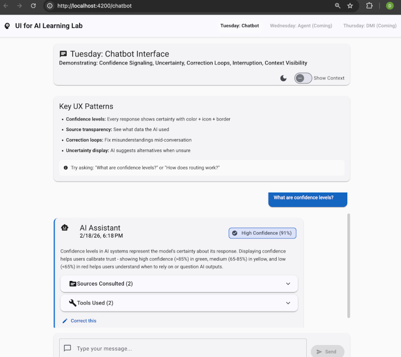

# UI for AI Quickstart: Agents, Chatbots & DMI Reporting

This is a learning lab. The aim is to give a skilled UI developer the principles to read and the study plan to work through, before starting work on a UI for AI project. 

It is also useful for testing out different dev tooling options for writing accessible UX for AI projects [docs/ai-tools-for-ui-a11y.md](docs/ai-tools-for-ui-a11y.md).

## Screenshot

*Tuesday's Chatbot Interface - demonstrating confidence signaling, source transparency, and correction loops*

---

## Principles & Patterns

See [docs/ui-for-ai-principles-and-patterns.md](docs/ui-for-ai-principles-and-patterns.md). Foundational principles, interface patterns, and curated resources for building trustworthy AI UX.

---

## Study Plan

See [docs/study-plan.md](docs/study-plan.md). One-week, day-by-day exercises covering mental models, chatbot correction loops, agent supervision, DMI reporting, and failure-safe design.

---

## Tester Scripts for Testing the UIs 

[CHATBOT-TESTER-SCRIPT.md](CHATBOT-TESTER-SCRIPT.md)

---

## Additional Docs & Scripts

- Quickstart guide: [QUICKSTART.md](QUICKSTART.md)
- Scripts overview: [SCRIPTS.md](SCRIPTS.md)
- License: [LICENSE](LICENSE)

---

