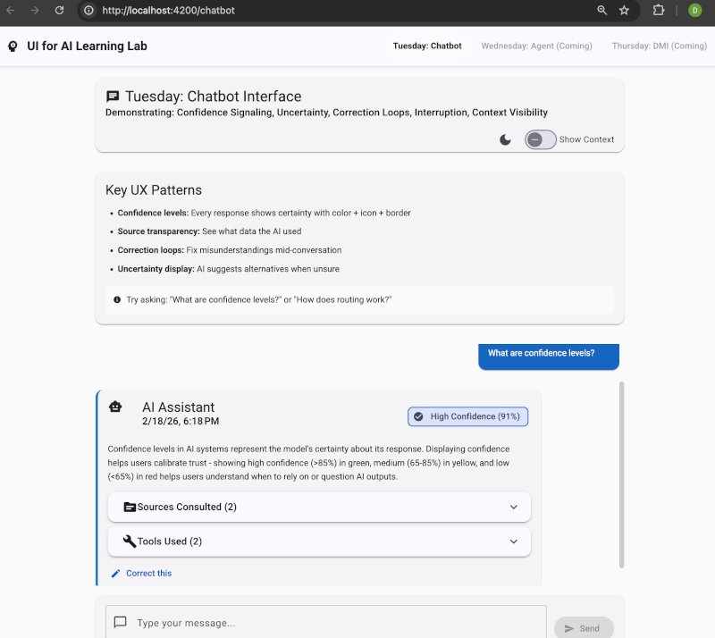

# UI for AI Quickstart: Agents, Chatbots & DMI Reporting

[Wake Backend API](https://ui-for-ai-backend.onrender.com/api/health)

This is a learning lab. The aim is to give a skilled UI developer the [principles](docs/ui-for-ai-principles-and-patterns.md) to read and the [study plan](docs/study-plan.md) to work through, before starting work on a UI for AI project. 

It is also useful for testing out different dev tooling options for writing accessible UX for AI projects [docs/ai-tools-for-ui-a11y.md](docs/ai-tools-for-ui-a11y.md).

## Screenshot

*Tuesday's Chatbot Interface - demonstrating confidence signaling, source transparency, and correction loops*

---

## Principles & Patterns

See [docs/ui-for-ai-principles-and-patterns.md](docs/ui-for-ai-principles-and-patterns.md). Foundational principles, interface patterns, and curated resources for building trustworthy AI UX.

---

## Study Plan

See [docs/study-plan.md](docs/study-plan.md). One-week, day-by-day exercises covering mental models, chatbot correction loops, agent supervision, DMI reporting, and failure-safe design.

---

## Tester Scripts for Testing the UIs 

[CHATBOT-TESTER-SCRIPT.md](CHATBOT-TESTER-SCRIPT.md)

---

## Meta Layer: Learning Through Implementation

See [docs/meta-learning-observations.md](docs/meta-learning-observations.md). Observations about the recursive learning experience - how implementing agent supervision UIs mirrors your experience using AI assistants like Claude Code.

---

## AI Development Tooling

See [docs/mcp-and-agents.md](docs/mcp-and-agents.md). Comprehensive guide explaining the distinction between MCPs (Model Context Protocols) and Agents in Claude Code - where they live, how they're configured, and when to use each. Essential reading for understanding how AI development tools are structured and how to extend Claude with custom functionality.

---

## Accessibility Testing & AI Tools

See [docs/ai-tools-for-ui-a11y.md](docs/ai-tools-for-ui-a11y.md). Comprehensive review of AI development tools for accessible UI implementation - covering Pa11y-ci for automated WCAG testing, theme-specific accessibility testing strategies, pre-commit hooks for quality gates, and practical workflows for building WCAG 2.2 Level AA compliant interfaces with AI assistance.

---

## Project Review & Learning Progress

See [docs/study-review.md](docs/study-review.md). Comprehensive technical review documenting static analysis success stories (accessibility bug detection with contrast calculations), Claude Code configuration milestones (MCPs, agents, hooks), and full architecture assessment covering Angular patterns, testing infrastructure, CI/CD pipeline, and production-quality code standards. Includes completed accessibility fixes and learning progression tracking.

---

## Additional Docs & Scripts

- Quickstart guide: [QUICKSTART.md](QUICKSTART.md)
- Scripts overview: [SCRIPTS.md](SCRIPTS.md)
- License: [LICENSE](LICENSE)

---
